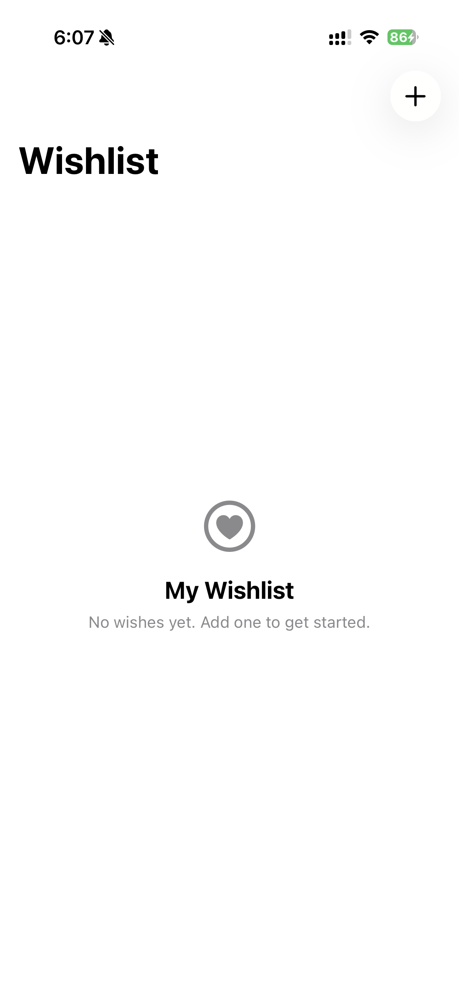
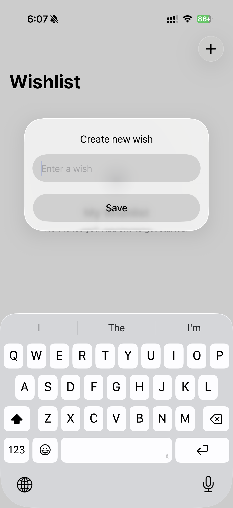
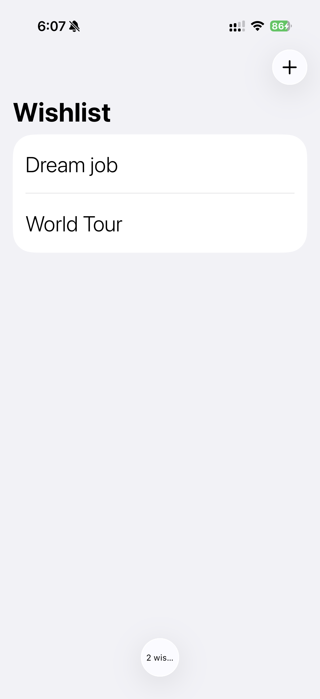
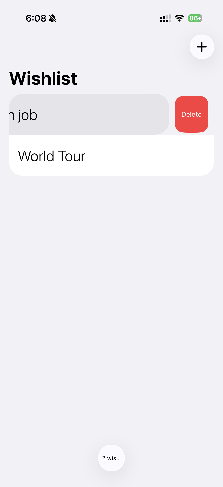

# WishlistApp ✨

WishlistApp is a simple and elegant SwiftUI app that lets users create and manage a personal wishlist.  
It uses SwiftData to store wishes locally, so your list stays saved between app launches.

---

## 📌 Features

- Add new wishes
- View all saved wishes in a clean list
- Swipe to delete wishes
- Persistent storage with SwiftData
- Empty state UI when no wishes are added
- Modern iOS-style design
- Smooth and simple user experience

---

## 📸 Screenshots

<p align="center">
  
  
  
  
</p>

<p align="center">
  <b>Empty State</b>
  &nbsp;&nbsp;&nbsp;&nbsp;
  <b>Add Wish</b>
  &nbsp;&nbsp;&nbsp;&nbsp;
  <b>Swipe to Delete</b>
  &nbsp;&nbsp;&nbsp;&nbsp;
  <b>Wish Count</b>
</p>

---

## 🛠️ Tech Stack

- Swift
- SwiftUI
- SwiftData
- Xcode
- iOS

---

## ⚙️ Requirements

- macOS
- Xcode 15+
- iOS 17+
- Swift 5.9+

---

## 🚀 How to Run

1. Clone the repository:

```bash
git clone https://github.com/DhruvPatel05/WishlistApp.git
